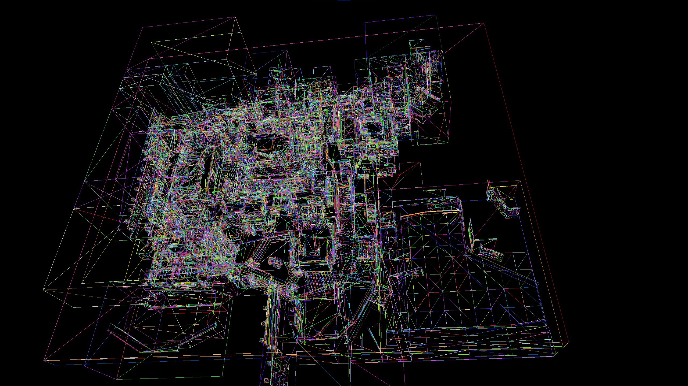

# [OUTDATED] CS2 Parser

A tool for parsing and visualizing Counter-Strike 2 physics files (.vmdl).



## Overview

This project provides a library for parsing Counter-Strike 2 physics files and a 3D visualization tool to render the extracted geometry. It allows users to extract collision meshes from CS2 maps and visualize them in a 3D environment.

## Project Structure

### Core Library (`/core`)

The core library contains the parser implementation that can load and process CS2 physics files:

- `cs2/parser.h`: Defines the main classes for parsing CS2 physics files
  - `Vec3`: 3D vector representation
  - `Triangle`: Triangle mesh primitive
  - `HullFile`: Represents a physics hull with triangles
  - `PhysicsFile`: Main class for loading and processing physics files

### Visualization Tool (`/test`)

The visualization tool uses DirectX 11 to render the extracted triangles:

- `renderer.h`: Defines the 3D rendering system
  - `Camera`: First-person camera for navigating the 3D scene
  - `Renderer`: DirectX 11 renderer implementation
  - `Application`: Windows application wrapper

## Usage

### Extracting Physics Data

```cpp
cs2::PhysicsFile physics;
physics.load("path/to/world_physics.vmdl", "working/directory");
physics.displayStats();
physics.writeTriangles("output.tri");
```

### Visualizing Extracted Data

Run the test application which loads the extracted triangle data and displays it in a 3D environment:

```
test.exe
```

Use WASD keys to move around, mouse to look, and mouse buttons to interact with the 3D view.

## Building

The project requires:
- C++17 compatible compiler
- DirectX 11 SDK
- Windows OS

## License

This project is provided as-is for educational purposes.
